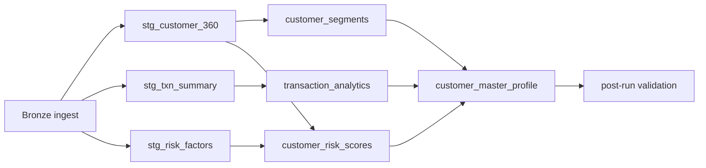

# Databricks re-platform

This directory contains the Azure Databricks implementation of the retail banking
analytics pipeline. The bundle deploys a Unity Catalog medallion layout:



The `retail_banking_pipeline` job follows the same DAG: bronze, three parallel
silver tasks, three gold tasks with their source dependencies, master profile,
then validation.

> **Data-model standards pending:** catalog, schema, table names, and Delta table
> properties currently follow the defaults in this brief. Reconcile them with the
> internal TD Databricks data-model standards document when it is available.

## Unity Catalog model

Each environment has its own catalog and the same four schemas:

| Schema | Tables |
| --- | --- |
| `core_banking` | `customers`, `accounts`, `addresses`, `customer_bureau_scores` |
| `txn_processing` | `transactions`, `transaction_types` |
| `etl_staging` | `stg_customer_360`, `stg_txn_summary`, `stg_risk_factors`, `etl_run_log` |
| `data_products` | `customer_segments`, `transaction_analytics`, `customer_risk_scores`, `customer_master_profile` |

`transaction_analytics` is partitioned by `reporting_period`. Customer-keyed
gold tables use `CLUSTER BY (customer_id)`. All tables use Delta auto-optimize
properties from `ddl/`.

## Local development

```bash
python -m pip install -e 'databricks[dev]'
PYTHONPATH=databricks/src pytest -q databricks/tests
ruff check databricks/
ruff format --check databricks/
```

The local harness uses run date `2026-04-10`, Delta Lake, and the CSV fixtures
under `data/`.

## Deploy and run

Install the current Databricks CLI (the `databricks-cli` PyPI package is a
different, legacy client), authenticate to the target workspace, then run:

```bash
cd databricks
databricks bundle validate -t dev
databricks bundle deploy -t dev
databricks bundle run retail_banking_pipeline -t dev \
  --params RUN_DATE=2026-04-10,LOOKBACK_MONTHS=12
```

The bundle uses `workspace_host` as a placeholder variable and does not contain
workspace credentials.

### Job parameters

| Parameter | Default | Meaning |
| --- | --- | --- |
| `LOOKBACK_MONTHS` | `12` | Transaction and risk lookback window |
| `RISK_SCORE_THRESHOLD` | `700` | Risk-score configuration |
| `RUN_DATE` | `{{job.start_time.iso_date}}` | Business processing date |
| `SKIP_SILVER` | `false` | Skip all silver tasks |
| `SKIP_GOLD` | `false` | Skip all gold tasks |
| `DRY_RUN` | `false` | Print plans and exit without processing |

Additional bundle parameters provide `CATALOG`, `SOURCE_PATH`,
`MLFLOW_EXPERIMENT`, `DQ_MIN_ROWS`, and `INGEST_MODE`.

The notebooks use `os.path.abspath(os.path.join(os.getcwd(), "../src"))` for
the source path. This keeps the notebooks thin and works with the bundle's
workspace-relative notebook layout.

## MLflow

Segmentation logs `SEG_V3.2` KMeans runs and risk scoring logs `RISK_V4.0`
model metadata. The sample risk target contains one class, so the risk port
uses and logs a constant fallback probability of default of `0.05`. The full
MLflow installation provides the sklearn model flavor; the helper still guards
the flavor import for skinny runtimes.

## Data quality and audit

Every silver and gold task wraps its transformation in `audit.step`, rejects
zero-row outputs with `assert_rows`, writes Delta, and runs `validate_table`.
Duplicate keys are errors, while null-key violations are recorded as warnings.
The `etl_run_log` table records status, message, row count, run date, and log
timestamp. `99_post_run_validation.py` prints the four gold row counts and the
latest audit rows for the requested run date.

## Secrets

Teradata `TD_SERVER`, LDAP credentials, and the old `{SAS004}` password are
obsolete in this design: Unity Catalog tables replace the SAS/ACCESS LIBNAME
connection. Any residual external-source credentials needed by Auto Loader
must be stored in the environment secret scope `retail-banking-<env>` and
retrieved with `dbutils.secrets.get`, never committed to this repository. The
bronze ingestion module includes a non-executed example in its module
documentation.

## Migration notes

| Legacy artifact | Databricks counterpart |
| --- | --- |
| `bteq/01_stg_customer_360.bteq` | `src/retail_banking/silver/stg_customer_360.py` |
| `bteq/02_stg_txn_summary.bteq` | `src/retail_banking/silver/stg_txn_summary.py` |
| `bteq/03_stg_risk_factors.bteq` | `src/retail_banking/silver/stg_risk_factors.py` |
| `sas/01_sas_customer_segments.sas` | `src/retail_banking/gold/customer_segments.py` |
| `sas/02_sas_txn_analytics.sas` | `src/retail_banking/gold/transaction_analytics.py` |
| `sas/03_sas_risk_scoring.sas` | `src/retail_banking/gold/customer_risk_scores.py` |
| `sas/04_sas_data_products.sas` | `src/retail_banking/gold/customer_master_profile.py` |
| `sas/macros/connect_teradata.sas` | Removed; Unity Catalog replaces LIBNAME |
| `sas/macros/log_step.sas` | `src/retail_banking/audit.py` |
| `sas/macros/validate_table.sas` | `src/retail_banking/dq.py` |
| `ddl/*.sql` | `databricks/ddl/*.sql` |
| `orchestration/run_full_pipeline.sh` + `config/pipeline_config.cfg` | `databricks.yml` + `resources/retail_banking_pipeline.job.yml` |
| `export_data.py` / local DuckDB | `tests/local_pipeline.py` |

## Known deviations

- Silver age and tenure use the calendar-year/calendar-month semantics present
  in the accepted reference outputs.
- Segmentation uses `log(max(total_balance, 1))`.
- Tenure and age group boundaries are inclusive where the accepted reference
  differs from the strict SAS comparisons.
- `channel_preference` is null to preserve reference CSV null semantics.
- `transaction_analytics` includes `total_fees`, which is present in the
  reference CSV but omitted from the original gold DDL.
- Risk uses full-feature sklearn logistic regression instead of SAS stepwise
  selection.
- Risk uses constant probability of default `0.05` for the sample's
  single-class target.
- `top_spend_category` uses deterministic SAS `MAX()` semantics. The reference
  value is an order-dependent DuckDB generator artefact and is excluded from
  strict equality; it is still required to be non-null wherever the reference
  is non-null.
- `spend_percentile` uses `rank() / N * 100`, matching the reference rather
  than PROC RANK's nominal `groups=100` output.

## Validation results

| Product | Rows / distribution |
| --- | --- |
| `customer_segments` | 407; ENGAGED_MAINSTREAM 103, PREMIUM_WEALTH 96, VALUE_BASIC 74, CREDIT_DEPENDENT 68, GROWING_DIGITAL 66 |
| `transaction_analytics` | 500 for reporting period `2026-04` |
| `customer_risk_scores` | 407; LOW 290, MODERATE 113, ELEVATED 4 |
| `customer_master_profile` | 407; completeness 407/407/407 for segment/transaction/risk joins |
