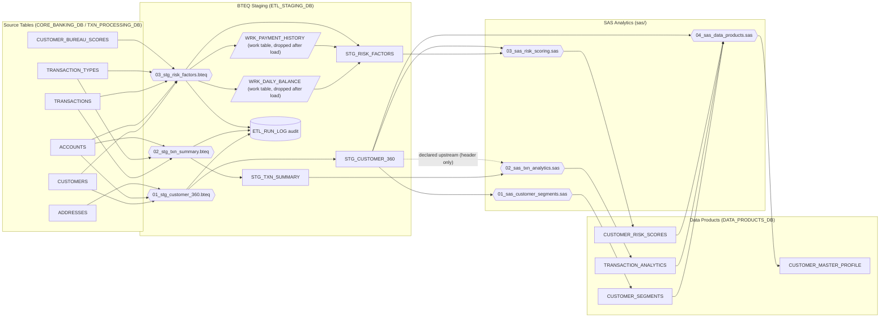

# Data Lineage — Retail Banking Analytics Pipeline

Table-level lineage for the full pipeline: source tables → BTEQ staging scripts → SAS analytics programs → data products. All dependencies below were extracted directly from the SQL/SAS code in `bteq/*.bteq` and `sas/*.sas`.

Rendered versions: [`data_lineage.png`](data_lineage.png) | [`data_lineage.svg`](data_lineage.svg)

## Lineage Graph

## Script Dependency Table

| Script | Input Tables | Output Tables |
|---|---|---|
| `bteq/01_stg_customer_360.bteq` | `CORE_BANKING_DB.CUSTOMERS`, `CORE_BANKING_DB.ACCOUNTS`, `CORE_BANKING_DB.ADDRESSES` | `ETL_STAGING_DB.STG_CUSTOMER_360`, `ETL_STAGING_DB.ETL_RUN_LOG` (audit insert) |
| `bteq/02_stg_txn_summary.bteq` | `TXN_PROCESSING_DB.TRANSACTIONS`, `TXN_PROCESSING_DB.TRANSACTION_TYPES`, `CORE_BANKING_DB.ACCOUNTS` | `ETL_STAGING_DB.STG_TXN_SUMMARY`, `ETL_STAGING_DB.ETL_RUN_LOG` (audit insert) |
| `bteq/03_stg_risk_factors.bteq` | `CORE_BANKING_DB.CUSTOMERS`, `CORE_BANKING_DB.ACCOUNTS`, `TXN_PROCESSING_DB.TRANSACTIONS`, `TXN_PROCESSING_DB.TRANSACTION_TYPES`, `CORE_BANKING_DB.CUSTOMER_BUREAU_SCORES`, `ETL_STAGING_DB.WRK_DAILY_BALANCE`*, `ETL_STAGING_DB.WRK_PAYMENT_HISTORY`* | `ETL_STAGING_DB.WRK_DAILY_BALANCE`*, `ETL_STAGING_DB.WRK_PAYMENT_HISTORY`*, `ETL_STAGING_DB.STG_RISK_FACTORS`, `ETL_STAGING_DB.ETL_RUN_LOG` (audit insert) |
| `sas/01_sas_customer_segments.sas` | `ETL_STAGING_DB.STG_CUSTOMER_360` | `DATA_PRODUCTS_DB.CUSTOMER_SEGMENTS` |
| `sas/02_sas_txn_analytics.sas` | `ETL_STAGING_DB.STG_TXN_SUMMARY`, `ETL_STAGING_DB.STG_CUSTOMER_360`** | `DATA_PRODUCTS_DB.TRANSACTION_ANALYTICS` |
| `sas/03_sas_risk_scoring.sas` | `ETL_STAGING_DB.STG_RISK_FACTORS`, `ETL_STAGING_DB.STG_CUSTOMER_360` | `DATA_PRODUCTS_DB.CUSTOMER_RISK_SCORES` |
| `sas/04_sas_data_products.sas` | `ETL_STAGING_DB.STG_CUSTOMER_360`, `DATA_PRODUCTS_DB.CUSTOMER_SEGMENTS`, `DATA_PRODUCTS_DB.TRANSACTION_ANALYTICS`, `DATA_PRODUCTS_DB.CUSTOMER_RISK_SCORES` | `DATA_PRODUCTS_DB.CUSTOMER_MASTER_PROFILE` |

\* `WRK_DAILY_BALANCE` and `WRK_PAYMENT_HISTORY` are intermediate work tables created inside `03_stg_risk_factors.bteq`, consumed to build `STG_RISK_FACTORS`, and dropped at the end of the same script.

\** `STG_CUSTOMER_360` is declared as an upstream dependency in the header comment of `02_sas_txn_analytics.sas` ("for account counts"), but the program body only reads `STG_TXN_SUMMARY`; the edge is shown dashed in the graph.

## Notes

- **ETL_RUN_LOG**: every BTEQ script inserts a completion row (`JOB_NAME`, `STEP_NAME`, `STATUS`, `ROW_COUNT`, `START_TS`, `END_TS`) into `ETL_STAGING_DB.ETL_RUN_LOG` as its final step. The SAS programs use a separate session-local audit dataset (`WORK.PIPELINE_AUDIT` via the `%log_step` macro) and do not write to `ETL_RUN_LOG`.
- **Execution order**: BTEQ 01 → 02 → 03 (03 depends only on sources plus its own work tables, but is scheduled after 02), then SAS 01/02/03 (each can run once its staging inputs exist), then SAS 04 last since it consumes all three data products.
- Source CSVs in `data/01_source_tables/` correspond one-to-one with the Teradata source tables (`customers.csv` → `CUSTOMERS`, etc.).
